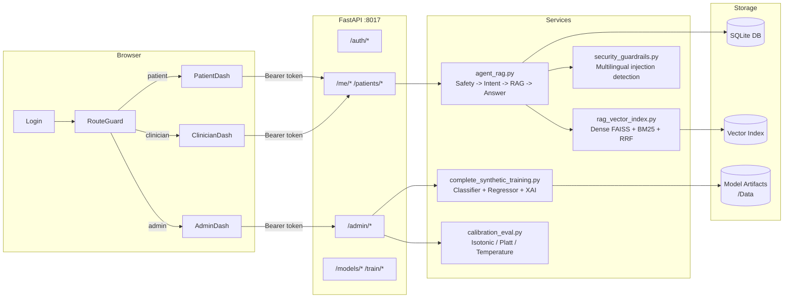
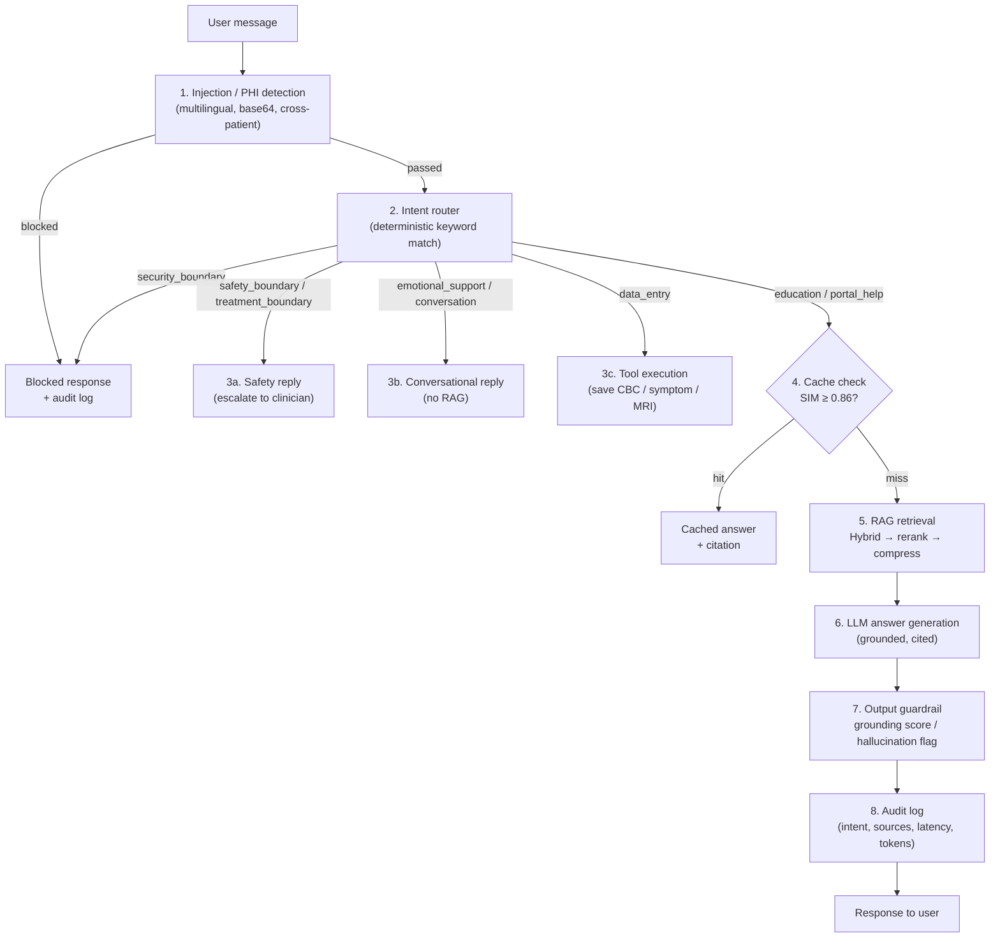

# NLCare: Safety-Governed Breast Cancer Monitoring Engineering Prototype

> **Clinical boundary:** Engineering prototype only. Not clinically validated. Not for real patient care. No clinician approval. Synthetic-only ML signals. Outputs must not be used for diagnosis, treatment, prognosis, genetic-risk interpretation, tumor-marker interpretation, or medication decisions.

NLCare is a safety-first, non-diagnostic engineering prototype for organizing synthetic breast-cancer monitoring records into patient and clinician-review workflows. It combines source-governed RAG, bounded support-agent tools, synthetic temporal ML signals, explicit abstention and claim boundaries, traceability, and prepared review queues. No clinician review has been completed, and none of its outputs are clinical evidence.

**Development status:** `BLOCKED_RELEASE`. The repository is suitable for local,
synthetic engineering demonstrations. DEP-001 remains behaviorally blocked on
consumed official evidence, and no real-patient, clinical, regulatory, or public
healthcare deployment is authorized.

## Acquisition / Technical Diligence

NLCare has a buyer-facing technical data room, machine-readable asset/license
contracts, a deterministic synthetic demo, and an integrity-checked archive and
verification flow. Start with [the buyer data room](docs/buyer/README.md).
This is transfer diligence for a pre-commercial engineering asset, not a sale,
production-release, clinical-readiness, revenue, user, or patient-benefit claim.

## Architecture at a glance

`React/TypeScript portal -> FastAPI/RBAC -> deterministic safety routing ->
bounded tools or source-governed FAISS+BM25 RAG -> claim/citation validation ->
post-generation and transport authorization -> audit/trace storage`.

Synthetic temporal ML runs behind independent evidence-sufficiency, abstention,
traceability, leakage/shortcut, calibration, and promotion gates. Automation is
redacted, signed, retry-bounded, disabled by default, and cannot prove human
acknowledgement.

## Reproducible quickstart

```bash
python -m pip install uv==0.8.24
python scripts/bootstrap.py --with-frontend
uv run uvicorn backend.api.main:app --host 127.0.0.1 --port 8017

cd frontend-react
npm run dev
```

`bootstrap.py` is the single documented setup command: it syncs the frozen
dependency set, downloads the semantic-safety encoders once, rebuilds the
derived RAG and lakehouse artifacts from tracked inputs, and then verifies the
safety runtimes actually load. Only the dependency sync and the one-time
encoder download touch the network; everything after that runs offline.

Open `http://127.0.0.1:5173`. See `.env.example` and
[environment configuration](docs/environment_configuration.md) before running.

Core verification:

```bash
uv run ruff check backend scripts tests
uv run mypy
uv run pytest tests -q --cov=backend --cov-branch --cov-fail-under=60
cd frontend-react && npm run lint && npm run typecheck && npm run test && npm run build
```

## Reproduce the ML pipeline

```bash
python scripts/run_training_pipeline.py
```

One command, deterministic by default (`--seed 42`). It trains the classical,
regression, and temporal models, then writes dataset lineage, a temporal
leakage audit, a detailed training report, a versioned evaluation report, the
locked-holdout manifest, and the registered champion, tracking the run as an
MLflow experiment.

Override the inputs with `--ml-csv-path`, `--target`, `--test-size`, `--seed`,
`--cnn-epochs`, or `--cnn-batch-size`. Full detail lives in
[ML lifecycle](docs/ml_lifecycle.md) and [evaluation](docs/evaluation.md);
model code is under `backend/services/complete_synthetic_training/`.

All data is synthetic. Nothing here is clinically validated.

Repository guidance: [contributing](CONTRIBUTING.md),
[dependency reproducibility](docs/dependency_reproducibility.md),
[security policy](docs/DEPENDENCY_SECURITY.md), and
[licensing/provenance](docs/LICENSING_AND_PROVENANCE.md).

Patient-facing RAG responses use a typed, fail-closed evidence envelope: missing,
unknown, malformed, or incomplete retrieval/claim/citation validation cannot
release an evidence-dependent answer. See
[fail-closed RAG evidence-envelope hardening](docs/rag_fail_closed_evidence_envelope.md).

The patient portal uses records-first progressive loading and prepares synthetic model enrichment in a bounded process-local background job, so a slow or failed engineering bundle does not blank the underlying records. High-priority support-chat language can create an auditable local review item with idempotency, bounded retries, append-only delivery attempts, dead-letter state, signed redacted n8n events, and signed channel receipts. External delivery is disabled by default and is locked to a synthetic test recipient when enabled; workflow acceptance or channel delivery never proves that a clinician saw or acted on an alert. See [patient progressive loading and review alerts](docs/patient_progressive_loading_and_review_alerts.md).

## Restricted synthetic SaaS foundation

NLCare now includes a separate tenant-aware control plane for organizations, memberships, projects, synthetic environments, engineering entitlements, non-billing usage events, evaluation jobs, a transactional redacted outbox, and audit events. Evaluation and outbox workers use idempotency keys, leases, recovery, bounded retries, and dead-letter states; strict multi-process profiles can use Redis-backed shared rate limiting. The admin workspace exposes projects, jobs, usage ceilings, and governance boundaries. The patient portal remains an isolated synthetic demo, not a multi-tenant clinical service. See [SaaS product boundary and roadmap](docs/saas_product_boundary_and_roadmap.md).

This is readiness for a restricted synthetic SaaS alpha foundation only. Live OIDC verification, managed-cloud deployment, audited billing, independent security review, external evaluation, real-patient-data handling, and healthcare production readiness remain incomplete.

## Evidence snapshot (August 2026)

The reviewer headline is `Data/evals/governance/latest_focused_release_summary.json`, not the largest or greenest metric in the repository.

- Deployment release: **blocked**. DEP-001 is `BLOCKED_BEHAVIORAL`; consumed candidate/bank evidence must not be rerun or tuned against. A configured artifact gate may pass while deployment remains blocked, and neither result is clinical-readiness evidence.
- Frozen internally authored adversarial results remain inconsistent: v4 pass rate `0.704918`, v5 `0.969697`, and v6 `0.518519`. Generalized hardening raises the now tuning-used v6 regression to `0.932099`, but it is no longer independent holdout evidence. The untouched, one-pass, author-contaminated v7 baseline is `0.676056`, with unsafe leakage `0.354545` and over-refusal `0.21875`; prompt injection, privacy, and cross-patient exfiltration are the weakest families. V7 will not be used for tuning. Safety is explicitly **not solved**.
- RAG: full source-governed Recall@10 `0.7838` versus BM25 `0.8041`. Raw retrieval improvement is not proven. The governed stack raises source-tier correctness from `0.4595` to `1.0` on the internal set, with about `4.13x` BM25 p95 retrieval latency.
- Paired RAG statistics: the full-stack Recall@10 favorable delta versus BM25 is `-0.02027`; the 95% paired-bootstrap interval is `[-0.108108, 0.067568]` and the Holm-adjusted randomization p-value is `1.0`. The interval includes no effect and meaningful harm/benefit, so raw retrieval lift remains unproven.
- ML: the calibrated classification champion does not prove paired accuracy superiority over logistic regression on the 120-row synthetic test export (`p=1.0`). Model complexity is retained as engineering comparison, not clinical evidence.
- Synthetic ML perturbation: removing the direct MRI response proxy lowers the guarded classifier from AUROC `0.997842` to `0.854343` and raises regression MAE from `2.463846` to `15.504482`. Patient-level modality dropout and default-to-realism-v2 transfer also breach predeclared degradation limits, so promotion remains `HOLD_SYNTHETIC_ONLY`.
- External data: an official TCIA I-SPY2 tabular bridge now joins 384 MRI-feature rows to its clinical cohort and compares simple/nonlinear pCR baselines over five fixed splits. The pCR task is target-mismatched, excluded from NLCare training and live inference, and cannot promote any NLCare model.
- Live RAG: the latest 21-case internal run reports citation precision `1.0`, source-tier correctness `1.0`, claim support `0.8333`, no unsafe answers, and p50 latency about `3.81s`. The sample is small and internal, so this is regression evidence only.
- Latency: the current 30-sample load probe succeeds at `1.0` with p95 about `4.40s`; the normal runtime route is about `4.08s` p95. These are local engineering measurements, not production SLO evidence, and `production_ready` remains `false`.
- Retrieval-cache regression: a repeated forced-sparse local probe reduced retrieval p95 from the fixed pre-cache baseline of `1806.32ms` to `71.08ms`. The result does not measure dense unique-query, network, cloud-load, or production behavior.
- Provider usage: structured token fields and reconciliation logic exist, but the current paired-request count and provider-reported usage coverage are both zero. Character-derived token estimates remain capacity-planning estimates, not billing truth.
- XAI: all 600 synthetic patient explanations export base values, complete contributions, and model outputs; log-odds additivity passes for every row with maximum residual `6e-10`. A 300-resample patient bootstrap reports stable grouped top-8 rankings, but a stricter 12-seed retraining audit finds only moderate top-feature overlap and unstable exact ordering (global p05 Jaccard `0.6`, p05 rank correlation `-1.0`). Arithmetic fidelity is verified internally; causal meaning, human comprehension, cross-retraining stability, and clinical validity are not.
- XAI presentation now fails closed: grouped factors may be shown, but exact rank claims and numeric SHAP values are hidden because retraining order is unstable. This is a presentation-safety policy, not proof of explainability.
- Fine-tuning remains `HOLD`. A word/character TF-IDF screen produced 150 reviewer candidates, including 7 critical-similarity pairs; none are adjudicated. Shared safety language can cause false positives, so these are review flags rather than 150 proven contaminations, but no adapter comparison can advance until they are resolved.
- Evidence maturity is reported without an aggregate score: 3 dimensions are scaffold/contract only, 6 have internal self-tests, 2 have frozen internal evidence, and none have independent external or institutional evidence. The architecture budget currently flags 11 warning-sized files and zero critical hotspots.
- Dependencies: `pyproject.toml` plus `uv.lock` is the canonical Python 3.11 reproducibility contract; direct compatibility manifests are pinned. Ruff, incremental mypy, full offline coverage, frontend lint/typecheck, and dependency audits are CI gates. This does not constitute a supply-chain certification, and a successful post-remediation Python advisory query is still required before release.
- Automation: redacted engineering jobs now have database leases, worker heartbeats, crash recovery, bounded retries/dead letters, signed dispatch, and persisted signed receipts. Local fault-injection, a 30-attempt localhost HMAC channel drill, SQLite restore, and non-patient data-platform replay checks pass. Container runtime, managed Postgres/Azure restore, managed-vector execution, external delivery, and human acknowledgement remain unproven. The system is not an emergency service.
- Agent actions: the orchestrator now applies a typed execution state machine with tool/step/write budgets, confirmation-before-write, forbidden-authority blocking, and memory-provenance checks. The six-case offline policy eval passes without a live patient write; this verifies software action boundaries, not medical correctness or real-world agent safety.
- RAG resilience: five disposable local-index drills cover corrupt-cache rebuild, fingerprint refresh, sparse fallback, missing optional metadata, and empty-query behavior. They pass offline, but do not establish managed-vector recovery, answer quality, production availability, or clinical safety.
- Review: no clinician, nurse, genetic counselor, or external author has completed a review.

See [RAG governance trade-off](docs/evals/rag_governance_tradeoff.md), [simple synthetic ML baselines](docs/evals/synthetic_simple_baseline_audit.md), [external dataset strategy](docs/data/external_dataset_integration_strategy.md), and [dependency reproducibility](docs/dependency_reproducibility.md).

## What this does NOT prove
- No clinical validation.
- No clinician-reviewed labels or clinician approval.
- No proof of real-world patient benefit or workload reduction.
- No real-world safety guarantee.
- Synthetic ML metrics are engineering self-tests only.
- Public-data mappings are stress tests and schema bridges, not validation.
- The unreviewed clinical advisor packet is prepared for future review only; it is not reviewed or approved.

## Scale / cost optimization
- The **AI Trinity** policy manages Accuracy, Latency, and Unit Cost as a non-compensatory gate: safety/source-governance and grounding floors must pass before faster or cheaper candidates can be promoted.
- `python scripts/run_ai_trinity_tradeoff.py` exports `Data/evals/governance/latest_ai_trinity_tradeoff.json`, including the fixed-goldset candidate table, latency budgets, provider-usage completeness, planning-only route scenarios, Pareto diagnostics, and an explicit promotion decision.
- A frozen 45-answer citation-selector holdout produced a negative result: citation precision fell from `0.0909` to `0.0429`; the selector remains offline and is not promoted or tuned on that fixture.
- `python scripts/run_provider_api_path_capture.py` emits readiness without spending quota. Actual normal-API provider capture requires `--execute`, an explicit paid-probe opt-in, and provider credentials; missing usage remains unknown rather than zero cost.
- Missing provider telemetry is reported as `blocked_evidence`, never as a measured `$0` unit cost. Character-derived tokens and pricing scenarios remain capacity-planning estimates.
- Cost and latency telemetry is tracked as engineering observability, not clinical evidence.
- `python scripts/run_cost_latency_report.py` exports `Data/evals/ops/latest_cost_latency_report.json` with provider-reported token usage when available, separately labelled estimates, pricing assumptions, cache behavior, sample-aware latency percentiles, and stage timing.
- `python scripts/run_rag_paired_statistical_comparison.py` adds paired bootstrap intervals, sign-flip randomization tests, practical-effect thresholds, and Holm correction to the fixed internal RAG baseline comparison.
- The report compares full API-style answering, validated cached answers, local-SLM-assisted routing/rewrite, and deterministic-only refusal paths.
- Local deterministic routes can have no provider charge, but absent provider usage on an API-capable route is unknown rather than free. Route comparison uses explicit token-price assumptions for capacity planning, not audited billing.
- Admin RAG dashboard now includes a Cost / Latency Observability card so reviewers can see p50/p95-style behavior and cache economics.
- Fine-tune promotion is offline/shadow-only and now requires matched paired cases, exact significance testing, immutable generation lineage, train-output memorization checks, per-behavior floors, zero safety regression, and bounded output-length growth.
- `python scripts/run_finetune_semantic_contamination.py` creates a privacy-minimized paraphrase-overlap review queue. Similarity screening is a proxy and never proves contamination is absent.
- `python scripts/run_xai_reliability_gate.py` converts synthetic fidelity and retraining-stability evidence into a fail-closed patient display policy.
- `python scripts/run_evidence_maturity_matrix.py` reports evidence provenance and architecture-budget violations without averaging weak and strong domains into a flattering project score.
- `Data/evals/governance/latest_credibility_gap_registry.json` separates controllable engineering gaps from external, institutional, and clinical evidence that the project cannot self-certify.

## Local SLM readiness
- Local SLM use is optional helper scaffolding only.
- Allowed low-risk tasks: intent classification, query rewriting, claim extraction, summary formatting, portal help, and refusal-style drafting.
- Local SLM output must remain behind deterministic safety gates, source governance, claim-level citation validation, medical-claim boundary checks, post-generation validation, and release gates.
- Local SLM must not be the final authority for diagnosis, treatment advice, prognosis, genetic-risk interpretation, tumor-marker interpretation, dosage, medication safety, or supplement safety.
- `python scripts/run_local_slm_readiness.py` exports `Data/evals/ops/latest_local_slm_readiness.json`.

## External stress-test readiness
- External/public data bridges are used for schema stress tests and missing-field analysis only.
- `python scripts/run_ispy2_tcia_tabular_bridge.py` runs the checksum-locked, de-identified TCIA I-SPY2 pCR stress benchmark. It excludes treatment arm and never feeds NLCare training or patient-facing inference.
- `python scripts/run_external_stress_readiness.py` checks TCGA-BRCA, METABRIC, BreastDCEDL/I-SPY common-feature rows, and Duke MRI/TCIA candidate mappings where artifacts exist.
- The output documents mapped fields, missing longitudinal modalities, expected abstentions, and failure cases.
- These stress tests do not validate the hybrid model clinically and cannot promote model outputs without exact-label temporal validation and clinician-reviewed endpoints.

## Retrieval precision and schema readiness
- Optional cross-encoder reranking can run after dense/sparse RRF when `RAG_ENABLE_CROSS_ENCODER=true`; unavailable models fall back safely without bypassing source governance or citation validation.
- `python scripts/run_retrieval_ablation_metrics.py` compares dense-only, sparse-only, hybrid RRF, and hybrid RRF plus cross-encoder/fallback using MRR, NDCG@k, Recall@k, source-hit rate, claim-support proxy, unsupported-answer proxy, and p50/p95 retrieval latency.
- Current reranker position: scaffolded and optional, not proven as a retrieval improvement unless `Data/evals/rag/latest_reranker_ablation.json` and the retrieval goldset show lift without higher unsupported context or latency risk.
- Structure-aware semantic chunking preserves Markdown headings, parent-child section links, and critical medical context such as lab/date, imaging finding/impression, medication timing, and family-history relation text.
- FHIR-aligned canonical objects prepare CBC/lab, medication, imaging, family-history, and condition records for future schema mapping. This is not certified FHIR interoperability and is not connected to a real EHR.
- A real-time OOD/data-quality gate checks impossible labs, unknown units, impossible dates, missing modalities, and suspicious structured input patterns before synthetic ML heads. It can lower confidence or abstain, but it is an engineering guardrail only.

## AI/SWE observability and release discipline
- Gold RAG eval cases now include n-size, pass/fail/skipped counts, authorship, tuning exposure, internal/external flag, contamination disclosure, baseline version, release ID, and case-level pass/fail criteria.
- Generalized unsafe-intent routing combines deterministic high-confidence patterns with prototype-based semantic matching for privacy/PII, prompt injection, cross-patient exfiltration, genetic/VUS overclaims, diagnosis confirmation, tumor-marker conclusions, treatment changes, dosage requests, prognosis estimates, and supplement replacement claims.
- Adversarial generalization is reported as separate original-bank, held-out, paraphrase, and safe-negative-control scores so internal tuning cannot be mistaken for broad safety proof.
- Held-out adversarial v1 and frozen internal holdout v2 are shown separately. V1 can improve through generalized hardening; v2 is a warning baseline and must not be tuned against without creating a newer holdout or external-author cases.
- Retrieval evidence quality is measured with a harder goldset containing expected source IDs, allowed tiers, near-duplicate distractors, stale-source distractors, and clinician-only distractors for patient-facing questions.
- RAG metamorphic evaluation mutates internal gold questions across polite, anxious, Taglish, hypothetical, and care-team framing to check route/evidence-policy stability via `python scripts/run_rag_metamorphic_eval.py`.
- Claim-source alignment emits a per-claim ledger linking supported gold claims to expected source IDs/tiers and blocked claims to refusal policy via `python scripts/run_claim_source_alignment_eval.py`.
- Route latency budgets are tracked as local engineering budgets; phase-2 latency profiling separates cold-start warm-up from steady local route latency. High p95 values are `needs_attention`, and passing local budgets is not production-readiness evidence.
- `python scripts/run_runtime_quality_sentinel.py` aggregates unsupported-claim, unsafe-answer, insufficient-evidence, over-refusal, source-governance, cache, latency, cost, and OOD warning signals into `Data/evals/ops/latest_runtime_quality_sentinel.json`.
- Bounded agentic workflow is limited to safe route planning, source-backed education, missing-detail collection, confirmation-before-write, and clinician-review summaries. `python scripts/run_agentic_tool_use_eval.py`, `python scripts/run_multiturn_agent_eval.py`, and `python scripts/run_adversarial_tool_use_eval.py` check that write tools require confirmation and forbidden medical-authority tools are not executed.
- Metamorphic safety testing mutates unsafe and safe educational prompts across hypothetical, emotional, Taglish/code-switched, pressure, and spacing-noise variants via `python scripts/run_metamorphic_safety_eval.py`. This checks route stability, not real-world safety.
- ML statistical evidence reporting wraps synthetic artifacts with confidence intervals, scenario-level comparisons, subgroup small-n flags, and explicit paired-test limitations via `python scripts/run_ml_statistical_evidence.py`. This improves statistical reporting discipline, not clinical validity.
- Row-level ML prediction evidence exports synthetic test-set rows and adds exact paired classification tests, paired bootstrap regression deltas, and calibration intervals via `python scripts/run_row_level_prediction_evidence.py`.
- ML statistical robustness now adds bootstrap intervals for champion classification/regression metrics, subgroup Wilson intervals, and synthetic label-noise sensitivity via `python scripts/run_ml_statistical_robustness.py`.
- ML logic/safety alignment now consolidates promotion policy, evidence sufficiency, calibration, temporal split hygiene, counterfactual stability, noise stress, shortcut-risk warnings, and statistical-boundary checks via `python scripts/run_ml_logic_safety_alignment.py`. It is designed to surface `needs_attention` findings honestly; it does not improve or validate clinical performance.
- Eval credibility auditing scans release-gate artifacts for n-size, pass/fail counts, provenance, contamination disclosure, clinical-validation false labels, and perfect internal-score risk via `python scripts/run_eval_credibility_audit.py`. This makes internal-eval limitations louder; it does not replace external review.
- Eval contamination registry separates tuning/regression banks, holdout/template cases, and external-author readiness via `python scripts/run_eval_contamination_registry.py`.
- Held-out adversarial v3 is a newly frozen internal baseline with 100+ privacy, prompt-injection, cross-patient, genetics/VUS, diagnosis, tumor-marker, treatment, dosage, prognosis, supplement, and safe-negative cases. Run `python scripts/build_adversarial_holdout_v3.py` and `python scripts/run_adversarial_holdout_v3_eval.py`; do not tune on v3 without creating a newer holdout or external-author set.
- After generalized v3 hardening, `python scripts/build_adversarial_holdout_v4.py` and `python scripts/run_adversarial_holdout_v4_eval.py` create the next fresh internal holdout. V4 must remain separate from tuning unless a v5 or external-author set is created.
- Agentic shadow mode compares the bounded planner and orchestrated turn path for route drift, forbidden-tool leakage, and unsafe-write leakage via `python scripts/run_agentic_shadow_mode_eval.py`.
- Phase-3 latency planning summarizes route p95s, bottlenecks, safe optimization backlog, and keeps `production_ready: false` via `python scripts/run_latency_phase3.py`.
- External dataset bridge v2 ranks GENIE BPC Breast Cancer, Duke Breast MRI/TCIA, TCGA-BRCA, METABRIC, and I-SPY/TCIA-style resources for future stress tests and schema bridges via `python scripts/run_external_dataset_bridge_v2.py`; this is not external validation.
- Production-readiness boundary reporting via `python scripts/run_production_readiness_boundary.py` explicitly says the system is production-shaped as an engineering prototype but not healthcare-production-ready.
- Deployment preflight reporting via `python scripts/run_deployment_readiness.py` checks environment posture, demo-auth risk, CORS configuration, Docker assets, readiness probes, and release-gate availability. This moves the software closer to deployable packaging while still blocking PHI, clinical-validation, and healthcare-production claims.
- FastAPI exposes `/health` and `/ready`; `/ready` returns `clinical_validation: false` and `healthcare_production_ready: false` so deployment probes cannot be confused with clinical readiness.
- `docker-compose.prod.yml` plus `frontend-react/Dockerfile` provide a production-shaped local container smoke path with a static Vite build served by Nginx and `/api` proxied to FastAPI. It is not a hospital/EHR/PHI deployment.
- `.github/workflows/ship.yml` runs `python scripts/ship.py` on PRs and checks generated OpenAPI frontend types for drift.
- Demo authentication is intended for development only and is disabled when `ENVIRONMENT=production` unless `ALLOW_DEMO_AUTH=true`.
- Strict deployment is intentionally blocked because the non-demo OIDC adapter and PKCE lifecycle have not been demonstrated against a live identity provider. The current deployment profile is local or controlled-demo only, even when container and environment checks pass.
- The evidence-based cross-domain critique and prioritized roadmap are in `docs/comprehensive_engineering_critique.md`; its ratings cover engineering credibility only, not clinical readiness.
- The executable eight-domain plan is in `docs/constraint_aware_improvement_program.md` with machine-readable evidence at `Data/evals/governance/latest_constraint_aware_improvement_program.json`. It covers AIE, MLE, SWE, data engineering, infrastructure, medical safety, automation, and deployment while separating internal acceptance criteria from external blockers.
- The service-health snapshot now aggregates measured RAG grounding and latency, abstention, adversarial leakage, automation controls, data quality, cloud readiness, and deployment posture. Missing proof remains visible rather than being represented by optimistic placeholders.
- Browser OIDC preparation now includes bounded single-process PKCE transaction storage, single-use callback consumption, expiry, replay rejection, and verifier non-disclosure. A live provider, shared encrypted store, token exchange, and provider logout are still absent, so production authentication readiness remains false.

## Cloud, data engineering, and managed vector readiness
- `python scripts/run_data_platform_pipeline.py` materializes a non-patient knowledge pipeline with content-addressed bronze sources, governance-enriched silver chunks, provider-neutral gold vector records, quarantine, data contracts, fingerprints, and lineage.
- `backend/services/managed_vector_store.py` exposes network-disabled-by-default contracts for local FAISS, Azure AI Search, and Pinecone. Managed services remain shadow candidates; no managed-vector improvement or deployment is claimed.
- `python scripts/run_vector_store_contract_eval.py` verifies namespace isolation, filter equivalence, banned identity-metadata rejection, and gold-record compatibility without making network calls.
- `config/vector_indexes/azure_ai_search_nlcare_kb.json` plus `python scripts/run_azure_search_index_readiness.py` define and validate the Entra/RBAC-oriented Azure AI Search shadow schema. Provisioning is opt-in; the current artifact performs no network request.
- `python scripts/run_managed_vector_shadow_sync.py` validates all 240 governed gold records and prepares deterministic 50-record batches. Embedding and indexing occur only with `--apply` and explicit managed-network gates; per-document receipts are checked and the live route stays unchanged.
- `python scripts/run_managed_vector_shadow_comparison.py` is ready to compare the unchanged frozen goldset against Azure. It currently reports `comparison_completed: false`, so no retrieval improvement is claimed.
- `python scripts/run_data_platform_reliability_eval.py` exercises local idempotency, quarantine isolation, schema migration, deterministic backfill, tombstones, and fallback. Managed delete and Azure restore remain unproven.
- `infra/azure/main.bicep` now compiles locally and includes opt-in private networking/DNS/endpoints, workload identity/RBAC, budgets/alerts, storage recovery retention, and private PostgreSQL networking. It has not had an authenticated Azure `what-if`, deployment, restore drill, or live load/cost validation.
- See [cloud, data, and vector architecture](docs/cloud_data_vector_architecture.md). These additions improve engineering structure only; they do not establish clinical validity, privacy compliance, real-world safety, or production healthcare readiness.

## External-author eval readiness
- External-author RAG and adversarial templates are prepared, but external-author evaluation has not yet been completed.
- Authors should not read prompts, code internals, safety-rule lists, or existing gold cases before writing cases.
- Templates live at `Data/evals/rag/external_author_case_template.jsonl` and `Data/evals/safety/external_author_adversarial_template.jsonl`.
- Concrete review packets are prepared under `docs/review_packets/` for external-author eval, nurse/clinician safety wording review, genetic-counselor/VUS review, and senior MLE eval review.
- `python scripts/run_external_review_readiness.py` checks that packet files and case templates are present and clearly marked unreviewed.
- These packets are explicitly unreviewed; no external review, clinician review, or genetic-counselor review has been completed yet.
- This prepares reviewer credibility work; it is not clinician approval or clinical validation.

Profile-ready summary: NLCare includes safety-governed RAG, adversarial generalization tracking, retrieval goldset evaluation, route-latency profiling, trace diagnostics, and synthetic-only MLE governance, while explicitly remaining unreviewed and not clinically validated.

## What this system is
- A timeline-first monitoring and clinician review assistant for already-diagnosed breast cancer cases.
- A proof-of-concept platform that produces monitoring signals, safety flags, and summaries for clinician review.
- A deterministic-first RAG support agent for low-risk education and portal help, with citations when retrieval context is used.
- A local MLE/MLOps sandbox for training, evaluation, and model lifecycle practice using synthetic journeys.

## What this system is NOT
NLCare is not an AI doctor, diagnosis bot, or treatment recommendation system.

- This system does not diagnose breast cancer.
- This system does not recommend treatment changes.
- This system does not replace clinicians.
- This system is not clinically validated.
- Synthetic data is used for POC workflow and safety testing, not clinical validation.

## Engineering maturity

Eleven hardening phases sit between the trained synthetic model and the patient-facing UI. Each ships with its own test suite and a corresponding admin-dashboard card. See **[docs/demo_storyline.md](docs/demo_storyline.md)** for a reviewer-facing walkthrough that exercises every phase end-to-end.

| # | Phase | What it guards | Hard CI gate | Live numbers |
|---|---|---|---|---|
| 1 | **Leakage audit** ([service](backend/services/leakage_audit.py)) | No label proxy enters the feature contract; patient IDs never overlap train/test; no feature is byte-identical to a label. | `tests/test_leakage_audit.py` — fails the build on regression. | 23/23 checks pass on production CSV across 4 seeds × multiple targets. |
| 2 | **Evidence-aware abstention layer** ([service](backend/services/evidence_sufficiency.py), [wrapper](backend/services/predict_with_abstention.py)) | Model returns `insufficient_evidence` when the input row lacks the modalities required for the question. Partial evidence shrinks the probability toward the prior. | `tests/test_evidence_abstention.py` — 18 rule + integration tests; 8-scenario sweep at `Data/evals/models/latest_evidence_abstention_eval.json`. | Full-evidence: 100% coverage, 92.4% accuracy. Demographics-only: 100% abstention. |
| 3 | **Prediction traceability** ([service](backend/services/prediction_trace.py)) | Every live prediction lands in `PredictionTrace` with model + feature-set + threshold + calibration + safety-trigger + validator-decision + RAG-source + abstention-state provenance. | `tests/test_prediction_trace.py` — 8 schema-completeness + filter tests. | 21-column table, populated by `predict_and_trace` on every patient-report fetch. |
| 4 | **Modality-dropout retraining** ([service](backend/services/modality_dropout_training.py), [comparison](backend/services/modality_robustness_comparison.py)) | Champion classifier retrained on augmented rows where random modality groups are masked. Head-to-head against the original model. | `tests/test_modality_robustness.py` — 9 tests including a production-data comparison gate. | +8.3pp accuracy and −7.3 Brier on `no_imaging` scenario vs. champion; no regression on `full_data`. |
| 5 | **Live evidence-aware inference** ([service](backend/services/live_evidence_prediction.py)) | Every `/me/report` fetch resolves the patient's most-recent cycle row, runs the abstention-aware classifier, persists a trace, and embeds the envelope in the response. | `tests/test_live_evidence_prediction.py` — 5 cohort + trace-persistence contract tests. | Patient dashboard shows decision, modalities used, confidence, claim boundary. |
| 6 | **Provenance + failure-mode registry** ([generator card](backend/services/synthetic_generator_card.py), [failure registry](backend/services/failure_mode_registry.py)) | Synthetic generator card pins schema, fingerprints rows, documents causal assumptions / known shortcuts / unsupported claims. Failure-mode registry consolidates engineering risks + failure case gallery + safety red-team failures + drift findings into one auditable table. | `tests/test_provenance_artifacts.py` — 9 structure + aggregation tests. | Generator card: passed, schema in sync. Registry: 17 entries, 6 high-severity, status reflects honest unresolved gaps. |
| 7 | **Clinician dashboard parity** ([trace endpoint](backend/api/routers/clinician_review.py), [PredictionTracesPanel](frontend-react/src/pages/clinician/PredictionTracesPanel.tsx)) | Clinician sees the same evidence-aware envelope the patient sees, plus an auditable trace log per patient (filter by abstention, summary chips). | `tests/test_clinician_prediction_traces.py` — 9 access-control + contract tests. | Endpoint gated to clinician + admin roles, patients blocked. |
| 8 | **Form catalogs + RAG governance + post-gen validator** ([catalogs](frontend-react/src/lib/clinical-constants.ts), [governance](backend/services/kb_source_governance.py), [validator](backend/services/post_generation_validator.py)) | Curated symptom/medication dropdowns with "Other" fallback. KB sources mapped to T1–T5 tiers with `allowed_use`. Post-gen validator blocks 6 banned-claim categories (diagnosis, treatment, prognosis, dosage, genetic-risk, tumor-marker) even when the LLM tries to make them. | `SelectWithCustom.test.tsx` (9) + `tests/test_rag_governance.py` (20). | Release gate now requires at least 40 governed KB sources, no governance issues, and current source metadata. 6 rules in validator catalog. |
| 9 | **Hybrid completion** ([hybrid_prediction.py](backend/services/hybrid_prediction.py)) | Classification + regression + toxicity heads, each through its own abstention sufficiency rules, bundled per patient view. Three trace rows per fresh report build (one per head, grouped by snapshot hash). | `tests/test_hybrid_prediction.py` — 9 per-head + bundle + live-integration tests. | Toxicity head scores when imaging is missing while response heads abstain — independent per-head sufficiency working. |
| 10 | **Regression hardening** ([quantile](backend/services/quantile_regression_training.py), [dropout](backend/services/modality_dropout_regression_training.py), [comparison](backend/services/regression_robustness_comparison.py)) | Response-score head no longer uses a heuristic uncertainty band: p10/p50/p90 quantile GBM heads emit a *genuine* 80% prediction interval sorted per row. Regression head also gets modality-dropout retraining; head-to-head shows the augmented variant wins on missing-imaging rows. Conformal calibration adds a residual qhat for empirical-coverage parity. | `tests/test_quantile_regression.py` (10) + `tests/test_regression_robustness.py` (8) + `tests/test_hybrid_prediction.py` regression slot. | Quantile coverage 76.2% vs 80% nominal (within 5pp). Modality-robust MAE on `no_imaging` drops 18.16 → 14.19 (Δ=-3.97 on 0–100 scale, the regression analog of the +8.3pp classifier result). |
| 11 | **Intent-aware RAG layer** ([modes](backend/services/rag_intent_modes.py), [tier filter](backend/services/rag_tier_filter.py), [claim validator](backend/services/rag_claim_validator.py), [evidence grading](backend/services/rag_evidence_grading.py), [Taglish parity](backend/services/taglish_safety_parity.py)) | 5 RAG modes (education / urgent_safety / record_explanation / clinician_context / portal_help) route per intent + actor role. Retrieved chunks are filtered against `kb_source_governance` tier + `allowed_use`. Per-sentence claim-level citation validation runs over the kept chunks. `EvidenceGrade` envelope (high/moderate/low/insufficient + source_basis + citation_status + answer_scope) ships on every reply. Insufficient evidence is a first-class outcome — substituted with the mode's safe deferral. Taglish-vs-English safety-route parity is enforced for 6 canonical clinical-safety cases. | `tests/test_rag_intent_aware.py` (31) + `tests/test_rag_trace_replay.py` (4) + `tests/test_finalize_helpers.py` (8). | 31 unit tests covering modes, tier filter, claim validator, evidence grading, Taglish parity (English ↔ Taglish route + scope match), intent-aware benchmark, tier ablation. Trace replay round-trip writes + reads back every Phase 11 field via the new RAGEvaluationLog columns (migration 0003). |

Run them all locally:

```
python scripts/run_leakage_audit.py
python scripts/run_evidence_abstention_eval.py
python scripts/run_modality_dropout_training.py
python scripts/run_modality_robustness_comparison.py
python scripts/run_synthetic_generator_card.py
python scripts/run_failure_mode_registry.py
python scripts/run_kb_source_governance.py
python scripts/run_quantile_regression_training.py
python scripts/run_modality_dropout_regression_training.py
python scripts/run_regression_robustness_comparison.py
python scripts/run_taglish_safety_parity.py
python scripts/run_rag_intent_aware_eval.py
python scripts/run_common_feature_transfer_stress.py
python scripts/run_public_distribution_realism_candidate.py
python scripts/run_realism_candidate_ab_gate.py
python scripts/run_dataset_expansion_deep_search.py
python scripts/run_priority_dataset_bridge.py
python scripts/run_priority_external_stress.py
python scripts/run_mutation_context_mapping.py
python scripts/run_dataset_fit_matrix.py
python scripts/run_governance_readiness_artifacts.py
python scripts/run_semantic_citation_verification.py
python scripts/run_semantic_claim_validation.py
python scripts/run_over_refusal_eval.py
python scripts/run_multilingual_adversarial_security.py
python scripts/run_live_rag_failure_analysis.py
python scripts/run_release_gate_explanation.py
python scripts/run_near_boundary_safety_eval.py
python scripts/run_uncertainty_dossier.py
pytest tests/test_leakage_audit.py tests/test_evidence_abstention.py \
       tests/test_prediction_trace.py tests/test_modality_robustness.py \
       tests/test_live_evidence_prediction.py tests/test_provenance_artifacts.py \
       tests/test_hybrid_prediction.py tests/test_clinician_prediction_traces.py \
       tests/test_rag_governance.py \
       tests/test_quantile_regression.py tests/test_regression_robustness.py \
       tests/test_rag_intent_aware.py tests/test_rag_trace_replay.py \
       tests/test_finalize_helpers.py
```

What this is *not*: any of these passing is engineering evidence, not clinical validation. The synthetic-to-real gap is itself the first entry in the failure-mode registry.

## Architecture overview
Flow:
Frontend / Dashboards -> Timeline and data-entry tools -> Deterministic scope/safety gate -> Intent router -> RAG / ML / tool workflow -> Validation and guardrails -> Clinician review -> Audit logs -> Evaluation and MLE dashboard

Key components:
- FastAPI backend and role-scoped portals.
- Timeline, risk, and multimodal monitoring services.
- Guardrailed RAG agent with hybrid retrieval.
- ML training, evaluation, and model registry lifecycle.
- Admin/MLE analytics and evaluation reports.

## AI / Agentic RAG layer
- Deterministic scope and safety checks, then intent routing and query rewrite/decomposition.
- Dense/sparse retrieval when local dependencies are available: sentence-transformer embeddings with FAISS, BM25 sparse retrieval, reciprocal-rank fusion, parent-child expansion, reranking, and contextual compression/windowing. A BM25 + TF-IDF sparse fallback is labeled honestly when dense dependencies are unavailable.
- Citation-checked answer generation with refusal/escalation on unsafe requests.
- Source-governed RAG modes filter retrieved chunks by source tier, allowed use,
  staleness, and patient-facing suitability before generation.
- Claim-level citation validation runs after generation; unsupported or
  contradicted medical claims trigger insufficient-evidence/refusal behavior.
- Live-agent RAG evaluation now calls the real patient pipeline and writes
  `Data/evals/rag/latest_live_rag_eval.json`; the release gate checks it.
- Optional LLM adjudication for routing and cache safety, with deterministic fallback.

Implementation: [backend/services/agent_rag.py](backend/services/agent_rag.py), [backend/services/retrieval_pipeline.py](backend/services/retrieval_pipeline.py), [backend/services/source_tier_filtering.py](backend/services/source_tier_filtering.py), [backend/services/claim_level_citation_validator.py](backend/services/claim_level_citation_validator.py), [backend/services/rag_vector_index.py](backend/services/rag_vector_index.py), [backend/services/local_llm.py](backend/services/local_llm.py). Details: [docs/rag_pipeline.md](docs/rag_pipeline.md) and [docs/ai_layer_maturity.md](docs/ai_layer_maturity.md).

## Cache policy
- Exact and semantic caches with TTL and knowledge-base fingerprint invalidation.
- Cache allowed only for low-risk, non-patient-specific educational or portal-help answers.
- If retrieval context is used, cached answers must include citations.
- Cache blocked for patient-specific, urgent, diagnosis/outcome, treatment-decision, or privacy-sensitive content.

Policy details: [docs/cache_policy.md](docs/cache_policy.md). Implementation: [backend/services/agent_rag.py](backend/services/agent_rag.py) and [backend/models.py](backend/models.py).

## Safety and guardrails
- Deterministic prompt-injection, privacy boundary, and urgent medical safety checks before any retrieval or generation.
- Output guardrails block treatment directives, diagnosis claims, and missing citation cases.
- Designed with healthcare privacy principles in mind, but not certified or validated for clinical deployment.
- All patient-specific or urgent outputs must be reviewed by a qualified clinician.
- RAG is used for grounded knowledge support, not autonomous medical decision-making.
- ML outputs are monitoring signals and risk flags, not diagnoses.

Implementation: [backend/services/security_guardrails.py](backend/services/security_guardrails.py), [backend/services/agent_rag.py](backend/services/agent_rag.py). Details: [docs/safety_and_limitations.md](docs/safety_and_limitations.md).

## Genetic Counseling Readiness
This project includes a non-diagnostic hereditary-risk support module. It organizes family cancer history, genetic-test records, biomarker/pathology results, and tumor-marker trends for clinician or genetic-counselor review. It does not diagnose inherited risk, interpret genetic variants as medical advice, predict whether a patient or relative will develop cancer, or recommend treatment changes.

Supported records:
- Family cancer history with relationship, maternal/paternal side, cancer type, age at diagnosis, male breast cancer flag, known familial mutation status, and privacy reminder.
- Genetic test records with germline/somatic/tumor sequencing type, blood/saliva/tissue sample type, gene, variant text, classification, report date, lab/provider, and genetic-counselor review status.
- Biomarker/pathology records for ER, PR, HER2, Ki-67, grade/stage text when present, report text, and clinician-review flag.
- Tumor-marker records for CA 15-3, CA 27.29, CEA, value, unit, reference range, date, and trend direction.

The RAG KB includes source-backed education for genetic counseling, hereditary breast/ovarian cancer, BRCA1/BRCA2 and related genes, germline vs somatic testing, VUS, multigene panels, ER/PR/HER2/Ki-67, and tumor-marker limitations. Safety checks refuse genetic overclaims, VUS-as-positive language, tumor-marker diagnosis claims, treatment-change requests, and uploads of identifiable relative records without consent.

Implementation: [backend/services/genetic_counseling.py](backend/services/genetic_counseling.py), [backend/services/genetic_counseling_eval.py](backend/services/genetic_counseling_eval.py), [frontend-react/src/pages/patient/GeneticCounselingPanel.tsx](frontend-react/src/pages/patient/GeneticCounselingPanel.tsx), [frontend-react/src/pages/clinician/GeneticReadinessCard.tsx](frontend-react/src/pages/clinician/GeneticReadinessCard.tsx).

## ML / MLE layer
- Synthetic longitudinal modeling for treatment success, toxicity risk, and support-intervention flags.
- Hybrid response modeling: binary classification estimates whether a synthetic journey looks favorable, while regression estimates a continuous `response_score_percent` from MRI-size change.
- The patient report exposes `hybrid_mle_signal`, currently 65% classifier probability score plus 35% normalized response-regression score, with an agreement label between classifier and regressor bands.
- Robust response-regression selection uses Huber/tree regressors plus a median ensemble and an outlier-aware score that penalizes RMSE.
- Current artifacts include temporal leakage audit, dataset lineage hashes/schema signatures, a locked synthetic holdout manifest, error taxonomy, and cost-sensitive threshold evaluation.
- Current training discipline uses development rows for training/calibration and evaluates once on a frozen locked synthetic holdout.
- Response uncertainty bands show when response-regression model families disagree.
- External validation direction is reported separately through the BreastDCEDL/I-SPY1 MRI-derived feature baseline.
- BreastDCEDL baseline response classifier using MRI-derived tabular features.
- Biomarker/tumor-marker retraining readiness is tracked as a separate feature-ablation benchmark. It compares monitoring-only features, the current default subtype-aware feature set, and an enhanced candidate with structured ER/PR/HER2/Ki-67, synthetic germline-risk flag, and CA 15-3/CA 27.29/CEA tumor-marker trend features.
- The biomarker feature benchmark reports feature lineage, missingness, leakage caveats, classification deltas, response-regression deltas, and a promotion recommendation. Current status is `monitor_only`: enhanced synthetic features are roughly comparable to the current default and should not be promoted without temporal and external/public-data validation.
- cBioPortal TCGA-BRCA/METABRIC clinical rows are exported into the canonical oncology schema for distribution and interoperability checks. These rows add public demographic, receptor/subtype, treatment-context, survival/recurrence, and mutation-count context, but they are not longitudinal NLCare monitoring rows.
- Common-feature transfer stress testing trains/evaluates only on shared fields (`age`, tumor-size proxy, HR/HER2/triple-negative indicators) across synthetic rows and BreastDCEDL/cBioPortal bridges. It reports distribution shift and cross-source brittleness while keeping `promotion_allowed = false`.
- A public-distribution realism candidate dataset is generated separately under `Data/external_bridge/realism_candidate/`. It shifts selected synthetic age and tumor-size proxy distributions toward public cohort summaries for A/B stress testing only; it is not a replacement generator and not clinical validation.
- The current-vs-realism-candidate A/B gate compares the current synthetic rows with the public-distribution candidate across leakage, classification, regression, shortcut, calibration-style, and counterfactual-stability checks. Current decision remains `keep_current_default`; the candidate is `ab_test_only`.
- Dataset expansion deep search now tracks the strongest next public/restricted sources for treatment histories, genomics, imaging response, biomarker context, and lab realism, with GENIE BPC BRCA and Duke Breast MRI as the highest-priority next bridges.
- The priority dataset bridge now creates explicit field contracts and templates for GENIE BPC BRCA and Duke Breast MRI, and can map permitted local CSV exports into the canonical oncology schema. With no local export provided, it reports `ready_for_mapping` rather than pretending real data has been integrated.
- Priority external stress checks endpoint compatibility and common-feature coverage for mapped GENIE/Duke rows, while keeping `promotion_allowed = false` unless exact-label temporal validation exists.
- Mutation-context mapping supports genes such as PIK3CA, TP53, GATA3, ESR1, ERBB2, BRCA1, BRCA2, PALB2, ATM, CHEK2, and PTEN as context-only features with genetic-counselor/clinician review routing. It explicitly blocks inherited-risk diagnosis, VUS-as-positive language, and treatment-response claims from mutations.
- Dataset fit matrix scores candidate public/restricted sources by treatment, temporal, imaging, biomarker, genomic, tumor-marker, lab, and student-access fit. It currently ranks I-SPY2, GENIE BPC BRCA, Duke Breast MRI, BreastDCEDL, and QIN-BREAST as the highest-leverage next data directions, while keeping production training blocked.
- Governance-readiness artifacts now include an offline gold claim-grounding set, semantic citation verification cases, near-boundary medical safety cases, an uncertainty dossier, a real-data readiness checklist, a clinical performance dossier template, structured event taxonomy, PoC ops health snapshot, controlled minimum-evidence docs, human-factors/overtrust notes, and a future clinical advisory workflow. These are reviewer-readiness artifacts, not clinician sign-off.
- Model artifacts, registry metadata, promotion/rollback, and local MLOps tracking.
- Versioned evaluation reports and MLE readiness gates.

Implementation: [backend/services/complete_synthetic_training.py](backend/services/complete_synthetic_training.py), [backend/services/breastdcedl_baseline.py](backend/services/breastdcedl_baseline.py), [backend/services/model_artifacts.py](backend/services/model_artifacts.py). Details: [docs/ml_lifecycle.md](docs/ml_lifecycle.md).

## Synthetic patient journey modeling
- Complete synthetic breast cancer journeys for labs, symptoms, treatments, interventions, imaging summaries, and outcomes.
- Used for workflow practice, safety testing, and MLE readiness evidence, not clinical validation.

Details: [docs/synthetic_data.md](docs/synthetic_data.md), [DATA_CARD.md](DATA_CARD.md), and [docs/data_dictionary.md](docs/data_dictionary.md).

## Behavior fine-tuning scaffold

- Fine-tuning is limited to synthetic response behavior and formatting; it does not inject medical knowledge.
- Dataset preparation is fail-closed and emits schema/privacy rejections, duplicate diagnostics, source hashes, deterministic train/development/internal-frozen splits, and exact-text contamination evidence.
- The QLoRA plan is a dry run only. A small official candidate, tokenizer, immutable revision, and Apache-2.0 license record are pinned; no weights are loaded and no adapter has been trained because runtime preflight is currently blocked.
- Baseline and candidate generations must cover at least 50 paired cases with complete IDs, zero unsafe leakage, full claim-boundary compliance, and no aggregate or per-behavior safety regression.
- The current 63-case internally authored frozen split is a tripwire and reference set, not independent evidence or a powered adapter comparison; meeting the two-point lift threshold would not be statistical proof by itself.
- Promotion remains `HOLD`; even a future `PROMOTE` verdict means offline/shadow testing only, never patient-facing or clinical use.

Run `python scripts/run_finetune_scaffold.py`. Contract: [docs/finetuning_boundaries.md](docs/finetuning_boundaries.md).

## Evaluation suite
- RAG regression, safety regression, ML metrics, and workflow feedback tracking.
- Genetic Counseling Readiness benchmark covers overclaim rate, VUS handling, germline/somatic correctness, referral correctness, treatment-advice leakage, family privacy boundaries, biomarker safety, tumor-marker overclaim rate, citation coverage, and clinician-review routing.
- Heuristic grounding and hallucination proxies until labeled RAG data exists.
- Detailed synthetic training report exports patient-level test predictions, regression residuals, slice metrics, and hybrid review-rule routing.
- Detailed MLE report also exports error taxonomy and cost-sensitive threshold policy tables.
- Admin/MLE dashboard includes detailed training report, locked holdout evaluation, external validation direction, and model-comparison cards.
- System proof table and claim mapping are tracked in [docs/system_proof.md](docs/system_proof.md).

Details: [docs/evaluation.md](docs/evaluation.md) and [evals/README.md](evals/README.md).

Benchmark ladder artifacts live under `benchmarks/` with a consolidated report generated by `python scripts/generate_benchmark_report.py`.

## Model registry and promotion/rollback
- Registry metadata and lifecycle endpoints support promotion and rollback.
- Production semantics are simulated locally to enforce safe lifecycle practice.

Details: [docs/model_registry.md](docs/model_registry.md) and [backend/services/model_artifacts.py](backend/services/model_artifacts.py).

## Feature-store materialization
- Local feature-store manifest with schema, hashes, and missingness for training and serving consistency.

Details: [docs/feature_store.md](docs/feature_store.md) and [backend/services/feature_store.py](backend/services/feature_store.py).

## Human-in-the-loop clinician review
- Clinician review queue and summary approval/edit/reject logging are built in.

Details: [backend/services/clinician_feedback.py](backend/services/clinician_feedback.py) and [backend/api/main.py](backend/api/main.py).

## Auditability
- App event logs, prediction audit logs, and RAG evaluation logs support traceability.

Implementation: [backend/services/app_logging.py](backend/services/app_logging.py) and [backend/models.py](backend/models.py).

## Setup instructions
1. Create a virtual environment and install dependencies:
   ```
   pip install uv==0.8.24
   uv sync --frozen
   .venv\Scripts\activate
   ```
   `pyproject.toml` + `uv.lock` are the canonical dependency source; `uv sync`
   creates `.venv` from them.

   **Which profile do you need?**

   | you want to | run | you get |
   | --- | --- | --- |
   | develop, test, train, or evaluate | `uv sync --frozen` | full developer environment |
   | only run the service | `uv sync --frozen --no-default-groups` | minimal serving runtime |

   The default installs every dependency group — `dev` (pytest, ruff, mypy),
   `ml` (torch, torchvision, sentence-transformers, shap), and `reporting`
   (matplotlib, reportlab) — because that is what running the test suite,
   the safety evaluations, and the training workflow requires.

   `--no-default-groups` installs `[project].dependencies` only: the packages
   the request path actually imports. That resolves to roughly 64 packages
   against ~146 for the default, and excludes torch, torchvision,
   sentence-transformers, shap, matplotlib, reportlab, and pytest. It is what
   the serving container builds
   (`Dockerfile`, `ARG PYTHON_PROFILE=serving`), and it is the right choice for
   anyone deploying the API who does not need to train or evaluate locally.

   Note that the semantic safety runtimes need their encoder provisioned once
   with network access before the offline suite is meaningful — see
   [CONTRIBUTING.md](CONTRIBUTING.md). A serving-only install still runs the
   API; it simply cannot run the local training and evaluation workflows.
2. Initialize the local database and seed demo data:
   ```
   python seed_db.py
   ```
3. Start the API:
   ```
   uvicorn backend.api.main:app --reload
   ```

## Demo flow
See [docs/demo_flow.md](docs/demo_flow.md) for a step-by-step patient, clinician, and admin demo walkthrough.

Demo credential routing:
- Patient demo: `P001` / `patient-demo` or any valid demo patient ID / `patient-demo`.
- Clinician demo: `clinician` / `clinician-demo`.
- Admin demo: `admin` / `admin-demo`.

The login form resolves the account role from credentials and redirects to the correct portal. The portals no longer expose role-switching links in the top navigation.

## Limitations
- Synthetic data is not clinical evidence; it is for engineering practice only. The synthetic-to-real gap is the first entry in the [failure-mode registry](backend/services/failure_mode_registry.py); see the generator card for the causal assumptions baked into the dataset and the shortcuts the model could exploit.
- The evidence-aware abstention rules are *defaults*, not learned — they need clinical-advisor sign-off before relaxation. The over-cautious failure mode is benchmarked as `false_abstention_rate` per scenario.
- The modality-dropout retraining establishes that the model handles synthetic missingness; clinical missingness in real patient records may follow different patterns.
- RAG metrics are heuristic proxies until labeled KB evaluation sets exist.
- Imaging analysis is derived from report text or tabular features, not validated clinical imaging models.
- No clinical validation, regulatory approval, or production privacy/security controls are claimed.
- **Not approved for real PHI.** See [docs/PHI_PRIVACY_LIMITATIONS.md](docs/PHI_PRIVACY_LIMITATIONS.md) for the explicit boundary and what real PHI handling would require.

## Database & migrations

The default config is local SQLite (`medical_agent.db`). Demo / dev still works via `python seed_db.py`. For any non-demo deployment, use Alembic:

```
alembic upgrade head            # apply all migrations to a fresh DB
alembic stamp head              # mark an existing DB as up-to-date (one-time)
alembic revision --autogenerate -m "describe change"   # create a new migration
alembic downgrade -1            # roll back one revision
```

`medical_agent.db` is local developer state and should not be committed. To
rebuild it, run `python scripts/reset_local_db.py`. See
[docs/local_database.md](docs/local_database.md).

## Future work
- Add labeled RAG evaluation sets and formal groundedness scoring.
- Expand multimodal signals with validated imaging workflows.
- Harden production security controls and PHI handling for real deployment.
- Add clinician-reviewed gold cases for summary quality evaluation.
- A/B test the current synthetic generator against the public-distribution realism candidate using the full leakage, shortcut, calibration, counterfactual, and release-gate stack before considering any generator change.
- Build the GENIE BPC BRCA and Duke Breast MRI mappers next; these are the most useful student-accessible bridges for treatment-history/genomics and imaging/treatment-context expansion.
- Replace rule-based abstention with a learned evidence-sufficiency head; current rules are explicit defaults a clinical advisor can review and override.
- Wire `predict_and_trace` into the clinician review surface so traces correlate with reviewer decisions in `ClinicalSummaryReview`.
- Bring the clinician dashboard up to the patient-portal's SectionCard + structured-form standard.

## Ops and governance docs
- [docs/threat_model.md](docs/threat_model.md)
- [docs/security_controls.md](docs/security_controls.md)
- [docs/incident_response.md](docs/incident_response.md)
- [docs/monitoring.md](docs/monitoring.md)
- [docs/regulatory_positioning.md](docs/regulatory_positioning.md)
- [docs/ci_cd.md](docs/ci_cd.md)

## Detection and measurement layers (informational, synthetic-only)

A second-pass hardening set focused on **detection and measurement**, not
new clinical claims. Every artifact in this section is labeled
`status: informational` in the release gate so it does not dilute the
blocker tier. Synthetic-only; no clinical validity is established.

- [docs/patient_temporal_cv.md](docs/patient_temporal_cv.md) — patient-level temporal CV vs. naive row-level KFold, side by side, with patient_overlap_pairs lock-in.
- [docs/adversarial_safety_regression.md](docs/adversarial_safety_regression.md) — 200-case stable-ID adversarial safety bank across 15 categories (diagnosis, treatment-change, dosage, prognosis, genetic-risk, VUS, tumor-marker, supplement, urgent, prompt injection, cross-patient exfil, privacy/PII, Taglish, near-boundary hypothetical, safe negative controls).
- [docs/uncertainty_aware_retrieval.md](docs/uncertainty_aware_retrieval.md) — 6-status answerability routing: `answerable_with_citations`, `answerable_with_limited_context`, `insufficient_evidence`, `conflicting_evidence`, `clinician_review_required`, `refuse_due_to_safety`.
- [docs/emotional_distress_detection.md](docs/emotional_distress_detection.md) — affective-signal detector across English + Taglish, mapping to 5 response modes.
- [docs/eval_drift_tracking.md](docs/eval_drift_tracking.md) — JSONL time-series of headline metrics with regression detection per `release_id` + `commit_hash`.
- [docs/per_turn_trace.md](docs/per_turn_trace.md) — per-turn decision trace envelope (decisions only — chain-of-thought is rejected by `_scrub_cot` + `validate_trace_payload`).
- [docs/synthetic_data_quality.md](docs/synthetic_data_quality.md) — synthetic generator quality proxy with an enforced disclaimer that it is NOT a clinical realism measure.

## 10/10 under constraints — honest self-rating

A single document and machine-readable artifact summarise where the
project stands across 17 dimensions under its hard constraints
(synthetic-only, no clinician, no IRB, no real patient data).

- Doc: [docs/ten_out_of_ten_under_constraints.md](docs/ten_out_of_ten_under_constraints.md)
- Artifact: `Data/evals/governance/latest_10_out_of_10_constraint_roadmap.json`
- Tests (anti-overclaim lock-ins): `tests/test_ten_out_of_ten_roadmap.py`

**"10/10 under constraints" is NOT clinical validation, is NOT
production healthcare ready, is NOT hospital deployable, and is NOT
proven patient benefit.** The dimension `real_clinical_readiness` is
test-capped at 2.0/10 and cannot move without real patient data,
real clinician sign-off, and IRB approval. The current weighted
average across engineering sides (excluding `real_clinical_readiness`)
is **7.22/10**; the expected post-A-tier estimate is **8.0/10**.

## Held-out / external-author RAG evaluation (PREPARED, NOT COMPLETED)

The local research-paper corpus contains 21 provenance-tracked PMC papers
covering monitoring methods, PRO/ePRO workflows, genetics/VUS boundaries,
tumor-marker limitations, distress, supplements, MRI, and hematologic toxicity.
The 44-case internal retrieval suite reports full-stack Recall@10 `1.0000`, but
superiority over BM25 remains unproven (`p=1.0`). A separate 30-query live-pipeline
telemetry artifact exposes per-query latency and estimated versus
provider-reported tokens without retaining generated replies. These are internal
engineering measurements, not clinical evidence or a systematic review.

The internal frozen retrieval goldset (74 cases) has shaped retrieval
configuration choices, alias maps, and threshold defaults. Its result
is **in-sample** and `improvement_proven_vs_bm25` is `false` (the full
source-governed stack does not exceed BM25 on raw recall on this
goldset; it earns its keep on safety/governance).

A **held-out v2** goldset is **prepared** for external-author
evaluation under a no-read protocol but is **not completed**:

- Protocol: [docs/evals/no_read_rag_goldset_protocol.md](docs/evals/no_read_rag_goldset_protocol.md)
- Template: `Data/evals/rag/retrieval_goldset_holdout_v2_template.jsonl`
- Runner: `python scripts/run_rag_holdout_baseline_comparison.py`
- Artifact: `Data/evals/rag/latest_rag_holdout_baseline_comparison.json` reports `completed: false` and `status: ready_for_external_authoring` until a reviewer engages.

The held-out evaluation does **not** establish clinical validation,
clinician sign-off, or production healthcare readiness, regardless of
its score.

Runtime trace diagnostics are exported by `python scripts/run_trace_diagnostics_coverage.py` to `Data/evals/ops/latest_trace_diagnostics_coverage.json`. The artifact checks trace schema coverage and explicitly rejects private chain-of-thought storage.

## For Recruiters and Interviewers

### What this project demonstrates

**Applied AI/ML engineering** - not a toy demo. Key capabilities:

| Area | What was built |
|------|----------------|
| RAG pipeline | Dense sentence-transformer retrieval with FAISS + BM25 sparse retrieval + RRF fusion when dependencies are available; BM25 + TF-IDF sparse fallback with honest backend labels |
| Safety-first agent | Deterministic priority gates before LLM: injection detection, multilingual attack patterns, PHI boundary, treatment/diagnosis refusal |
| ML evaluation | AUROC, PR-AUC, Brier, ECE, sensitivity/specificity/FNR, cost-sensitive threshold (FN costlier than FP), locked holdout, external validation direction |
| Agent regression suite | 45 labeled test cases: education, portal_help, clinical_safety, security, conversation, tool_use - 100% pass rate |
| Model lifecycle | Register, promote, rollback, audit; calibration comparison (isotonic / Platt / temperature scaling) |
| Agent Trace Observatory | DB-backed per-call trace log: intent, safety level, guardrail status, RAG sources, grounding, latency, tokens - live in Admin dashboard |
| RAG Ablation Study | BM25-only vs sparse BM25+TF-IDF vs dense FAISS+BM25+RRF vs full reranked pipeline on education eval cases |
| Per-Prediction Error Table | TP/FP/TN/FN per synthetic holdout prediction; MAE, sensitivity, specificity, SHAP top-features per row |
| Noise Robustness Eval | 5 EHR-realistic perturbations (missingness, jitter, unit error, batch effect, contradictory records) with AUROC/sensitivity degradation |
| Temporal Generalization | Patient-timeline split + cycle-accumulation split vs random baseline; generalization gap reporting |
| Progressive Chat UX | Pipeline-stage status labels while waiting (safety gate -> intent -> retrieval -> generation) |
| Frontend | React + TypeScript + Vite, role-based routing, chat panel with tool-call confirmations, metric interpretation bands |
| Governance | System card, model cards (3), RAG pipeline doc, MLE evaluation report, audit logs |
| Leakage audit (CI gate) | Hard build-failure check: patient-ID split disjointness across multiple seeds, 8-entry known label-proxy denylist, feature-vs-label byte-identity detection — 23/23 production checks pass |
| Evidence-aware abstention | Rule-based sufficiency layer + abstention envelope (`decision`/`probability`/`confidence`/`evidence`/`model_version`); refuses to score 100% of demographics-only rows while keeping 100% coverage and 92.4% accuracy on full-evidence rows |
| Prediction traceability | 21-column `PredictionTrace` table — every live inference records model + feature-set + threshold + calibration + safety-trigger + validator-decision + modalities-present provenance; live in admin dashboard |
| Modality-dropout retraining | Champion classifier retrained on rows with stochastically masked modality groups; head-to-head vs. original shows +8.3pp accuracy and −7.3 Brier on `no_imaging` with no regression on `full_data` |
| Generator card + failure-mode registry | Synthetic generator card pins schema/seed/cohort/fingerprint + documents causal assumptions, known shortcuts, unsupported claims; failure-mode registry consolidates 17 entries across engineering risks, narrative cases, safety-red-team failures, and drift findings |
| Synthetic-only hardening phase | Self-supervised prior-timeline pretraining, counterfactual stability checks, learned-abstention candidate, per-head calibration, shortcut audits, minimum-evidence standards, and medical-claim-boundary evals. These are engineering proxy checks only, not clinical validation. |

### Architecture (Mermaid)



### Agent Flow (Mermaid)



### What this proves / What this does not prove

**Proves:**
- Ability to design and implement a multi-layer safety architecture for healthcare AI
- Disciplined evaluation pipeline: regression suite, holdout, calibration, cost-sensitive thresholds
- RAG engineering: retrieval, reranking, caching, grounding scoring, hallucination detection
- ML lifecycle practice: training, versioning, promotion, rollback, model cards, audit logs
- Full-stack integration: React SPA + FastAPI + SQLite + vector index + local ML models
- Data-hygiene discipline: leakage audit as a hard CI gate, every prediction emitted with explicit modality provenance, abstention as a first-class output state
- Honest provenance: synthetic generator card with documented causal assumptions / known shortcuts / unsupported claims; consolidated failure-mode registry instead of hand-waving over known gaps
- Hardening against synthetic-only overclaiming: shortcut audit flags generator-derived dependencies, counterfactual stability reports brittle cases as `needs_attention`, and per-head calibration reports separate uncertainty stories for response classification, response-score regression, toxicity, and abstention

**Does not prove:**
- Clinical validity — all model training and testing uses synthetic or non-validated data
- HIPAA/regulatory compliance — no certified security controls are in place
- Production scalability — SQLite and in-process models are for local/demo use only
- Clinical decision support accuracy — the system is a monitoring and review aid, not a diagnostic tool
- That biomarker, tumor-marker, genetic, or imaging features improve real outcomes — current improvements and failures are synthetic engineering signals only

### Synthetic-only hardening commands

```bash
python scripts/run_synthetic_realism_hardening.py
python scripts/run_self_supervised_timeline_pretraining.py
python scripts/run_counterfactual_stability_eval.py
python scripts/run_learned_abstention_eval.py
python scripts/run_per_head_calibration.py
python scripts/run_shortcut_audit.py
python scripts/run_minimum_evidence_standards.py
python scripts/run_medical_claim_boundary_eval.py
```

Honest reading: `needs_attention` can be a valid output. For example, shortcut and counterfactual reports are supposed to surface generator shortcuts or brittle perturbations rather than hide them behind a green badge.

### How to run (30 seconds)
```bash
# 1. Install Python dependencies (pyproject.toml + uv.lock are canonical)
pip install uv==0.8.24 && uv sync --frozen

# 2. Start backend
uvicorn backend.api.main:app --host 127.0.0.1 --port 8017 --reload

# 3. In a new terminal, start React frontend
cd frontend-react && npm install && npm run dev

# 4. Open http://localhost:5173
# Demo: P001 / patient-demo  |  clinician / clinician-demo  |  admin / admin-demo
```

---

## React Frontend (frontend-react/)

A modern React + TypeScript + Vite frontend for the same backend. The legacy HTML files in `frontend/` remain untouched.

### Running the stack

**1. Start the backend (port 8017)**
```bash
uvicorn backend.api.main:app --host 127.0.0.1 --port 8017 --reload
```

**2. Start the React dev server (port 5173)**
```bash
cd frontend-react
npm install
npm run dev
```
Open http://localhost:5173. The React API client calls http://127.0.0.1:8017 directly.

### Available scripts (frontend-react/)
| Command | Description |
|---------|-------------|
| `npm run dev` | Start Vite dev server on port 5173 |
| `npm run build` | Type-check and build to `dist/` |
| `npm run lint` | Run frontend lint checks |
| `npm run typecheck` | Type-check both tsconfig projects without emitting |
| `npm run test` | Run the Vitest unit suite (33 files, 301 tests) |
| `npm run test:coverage` | Same suite with the coverage thresholds in `vitest.config.ts` enforced |
| `npm run test:e2e` | Run Playwright smoke tests for login, patient, clinician, admin, and route guards |
| `npm run preview` | Serve the production build locally |

### Quality gate
```bash
# Commit-time integration gate for chat/RAG/citation regressions.
python scripts/install_pre_commit.py

# Release gate: checks required benchmark artifacts for freshness/status/thresholds.
python scripts/run_release_gate.py

# Full local ship gate on machines with GNU make.
make ship

# Cross-platform ship gate for Windows/Linux without GNU make.
python scripts/ship.py

# Faster local feedback, evidence-only refresh, or safe resume.
python scripts/ship.py --tier fast
python scripts/ship.py --tier evidence
python scripts/ship.py --tier release --resume

# Fast local gate: lint, build, backend tests, MLE readiness, RAG ablation,
# and latest strong agent-regression artifact.
python scripts/run_quality_gate.py --skip-slow-agent

# Full UI smoke included. Requires: cd frontend-react && npx playwright install chromium
python scripts/run_quality_gate.py --skip-slow-agent --include-e2e
```

See [docs/pre_commit_gate.md](docs/pre_commit_gate.md) for hook install and
manual run details. See [docs/how_to_use_precommit.md](docs/how_to_use_precommit.md)
for the pre-commit framework option, [docs/release_gate.md](docs/release_gate.md)
and [docs/swe_release_discipline.md](docs/swe_release_discipline.md)
for artifact thresholds, and [docs/reviewer_evidence.md](docs/reviewer_evidence.md)
for the proof map reviewers can use to inspect claims.

### Proof and limitation docs

- [Full potential under current constraints](docs/full_potential_under_constraints.md) defines what "10/10" means while the project remains synthetic-only and not clinically validated.
- [Limitations](docs/limitations.md) lists current hard limits and what must wait for clinician/data access.
- [July 2026 cross-domain hardening](docs/cross_domain_hardening_2026_07.md) maps patient-scoped agent confirmation, receipt integrity, synthetic sensitivity tests, UI-backed XAI checks, partition-scale replay, guarded Azure parameters, and bounded ship execution to their remaining limitations.
- [Senior engineering evidence under current constraints](docs/senior_engineering_evidence.md) binds selected claims to source/test/artifact hashes, composed failure injection, exact ship commands, negative findings, and explicit falsification criteria.
- [What this does not prove](docs/what_this_does_not_prove.md) is the anti-overclaim checklist for demos, README copy, CV bullets, and interviews.
- [Unreviewed clinical advisor packet](docs/medical_advisor_review_packet.md) plus [review log template](docs/medical_advisor_packet/review_log_template.md) and [rubric](docs/medical_advisor_packet/rubric.md) are prepared for future clinician/nurse/pharmacist/genetic-counselor review. They have not been reviewed or approved.

### Demo credentials
| Username | Password | Destination |
|----------|----------|-------------|
| `P001` | `patient-demo` | Patient dashboard |
| `P002` | `patient-demo` | Patient dashboard |
| `clinician` | `clinician-demo` | Clinician review queue |
| `admin` | `admin-demo` | Admin / MLE dashboard |

Role is inferred from credentials — no manual role selection after login.

### Pages
- `/login` — credential form with demo quick-fill pills
- `/patient` — timeline, labs, AI snapshot, model signal, chat support
- `/clinician` — review queue, patient detail, approve/edit/reject workflow, audit trail
- `/admin` — RAG metrics + ablation study, guardrails, Agent Trace Observatory, MLE gates + noise/temporal/error table, regression suite, feedback log
# July 2026 constraint-bound engineering hardening

The latest pass adds controls and measurements without changing the project's
clinical boundary:

- Frozen internal adversarial v6 scored `0.5185` with unsafe leakage `0.5606`
  and over-refusal `0.1333`. Its failure taxonomy subsequently informed
  generalized classifier work, so a separate retrospective now labels v6
  `tuning_informed_not_held_out`. The frozen file was not rerun or overwritten,
  while a separate tuning-regression artifact re-executes its cases without
  overwriting the baseline. It is no longer presented as independent
  post-tuning evidence.
- A separate v7 bank was frozen only after the development mutation work
  closed, then executed once. It scored `0.6761`, with unsafe leakage `0.3545`
  and over-refusal `0.2188`. It remains internally authored and
  author-contaminated, is excluded from the repeatable ship runner, and will
  not be used for tuning.
- Unsafe-intent detection now combines deterministic patterns, prototype
  similarity, and generalized action/object concept rules. A separate
  development mutation set is marked `was_used_for_tuning: true` and is never
  presented as held-out evidence.
- Source-tier and allowed-use filtering now runs before answer generation, with
  a second post-generation governance/claim check retained as the final layer.
- Claim validation now records atomic claim type, polarity, temporality,
  population scope, numeric facts, and structured alignment checks. The default
  remains heuristic unless a local NLI model is available; it is not a
  clinical-grade entailment system.
- Chat record writes bind confirmation to the exact preview digest, expire,
  reject tampered state, prevent duplicates, retain provenance, and remain
  undoable. Conversation memory is explicitly untrusted and non-authoritative.
- A causal-order synthetic v3 stress benchmark now compares simple and
  nonlinear classifiers/regressors across 30 seeds and clean, MAR/MNAR,
  measurement-noise, and subgroup-shift scenarios with paired bootstrap
  intervals. Promotion remains `HOLD`; the simulator is not clinical realism.
- The XAI export now includes base values, all feature contributions, mean model
  log-odds/probabilities, and reconstruction residuals for all 600 synthetic
  patients. Additivity passes mechanically, while one-hot/proxy display risks
  remain visible and causal/clinical interpretation stays prohibited.
- XAI ranking stability is measured over 300 patient-bootstrap resamples using
  grouped patient-display features, top-k overlap, and rank correlation.
  Near-outcome proxies stay excluded from patient-facing rankings. This is
  internal stability evidence only; no human-comprehension, causal, retraining,
  or clinical interpretation is claimed.
- Engineering automation supports caller-supplied idempotency, conditional
  database leases, heartbeat renewal, expired-lease recovery, bounded retries,
  dead letters, audited manual requeue, signed n8n dispatch, and persisted
  signed receipts. It remains redacted and dry-run-first, and cannot automate
  medical decisions or infer clinician acknowledgement from channel delivery.
- The local CPython 3.14/Windows environment now has a generated exact
  transitive dependency lock and fingerprint audit. It does not cover the
  Python 3.11/Linux CI environment or substitute for dependency vulnerability
  scanning.
- A compact 20-check release decision surface separates hard blockers from warnings so
  the full artifact registry cannot visually dilute weak generalization,
  retrieval, latency, XAI, or dependency evidence.
- A separate 66-case compositional safety-development bank now passes internally
  across indirect, hypothetical, emotional, Taglish, and safe-negative cases.
  It is tuning-used evidence and does not prove external generalization.
- The behavior-only fine-tuning corpus now has 417 accepted examples with
  291/63/63 train, development, and internal-frozen splits. A 135M candidate
  and revision are pinned, but runtime preflight is blocked, no adapter has
  been trained, and the promotion decision remains HOLD.
- Duke Breast Cancer MRI / TCIA tabular data is evaluated as a checksum-locked,
  isolated pCR engineering stress task. MRI feature addition hurt the tested
  clinical baseline, so the negative result is retained and no NLCare model is
  promoted.
- A feature-flagged OIDC verifier now enforces signed RS256 JWTs, issuer,
  audience, timestamps, role mapping, and patient identity claims. S256 PKCE
  request/callback primitives and a bounded single-process, single-use
  transaction store exist, but a live provider, shared encrypted transaction
  store, token exchange, and provider logout are not yet demonstrated.
- Automation fault injection covers eight queue, lease, replay, receipt,
  signing, and stale-event failures. Retry attempts now preserve one durable
  external event ID; no live recipient reliability or human acknowledgement is claimed.
- A localhost signed-channel drill exercises 30 real HTTP round trips through
  dispatch signature verification and synthetic receipt verification. It uses
  redacted test payloads and does not claim external channel delivery, n8n
  operation, clinician acknowledgement, or clinical action.
- A structured claim/source verifier runs in shadow only, and the XAI wording
  contract checks explanation completeness. Neither is a clinical entailment
  system or a human-factors study.
- Production and recovery Compose manifests validate, while the full isolated
  Postgres/Redis migration, backup, restore, and persistence smoke remains
  `blocked_environment` because the local Docker daemon was not healthy.

These are synthetic/internal engineering controls. NLCare remains unreviewed,
not clinically validated, and not production healthcare ready.
